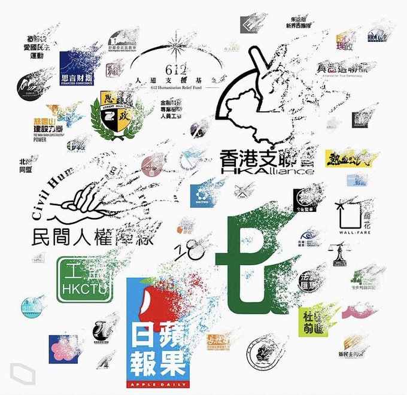

 
(_Courtesy: Hong Kong Freepress, 2021_)

SHKO (Save Hong Kong Online) is a community project to preserve those disappearing online web sites since 2019 and in a wake of [[the vast disappearing of civil society and independent media | background]]. It's anonymous and open source, with the support from a lot of online users. 

## Goals
- To preserve as much information as possible before its disappearance during Hong Kong's great transition
- To illustrate a viable method that everyone can use to help preserve online heritage with no pains
- To demonstrate global collaborations to save local digital heritages with best practices

## Quick Facts

We are working on over dozens of [[websites or online causes | sites]] in Hong Kong in the past two decades which has been forced to shutdown or at the brink of disappearing. We'd welcome anyone help [[contribute | howto]] to the content and/or [[sponsor | sponsorship]] our program to sustain it together. 

Examples:
- [[sites.appledaily]] (Extincted)
- [[sites.inmediahk]] (In Danger)

