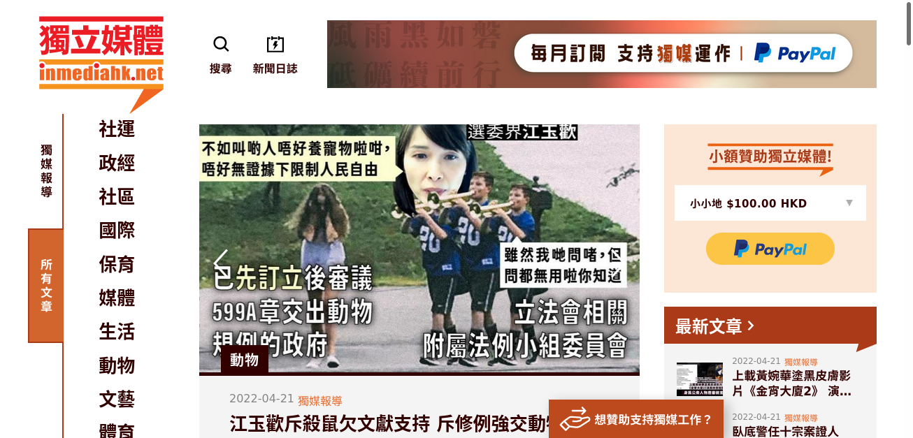

>
獨立媒體，2020年12月10日前稱香港獨立媒體（英語：Hong Kong In-media）是一個以香港為基地的網媒，網站主要內容為時事評論，涉及不同社會政治及文化議題。-- [Wikipedia](https://zh.wikipedia.org/wiki/%E7%8D%A8%E7%AB%8B%E5%AA%92%E9%AB%94_inmediahk.net)

Founded in 2004, Hong Kong In-media is an independent news & media platform for democratic and social movement. The platform centres on a wide range of social, political and cultural issues of Hong Kong.

Official site: https://www.inmediahk.net/

## Archives 

- [.WACZ as of 2022-5-3](https://bafybeighmfirp4em5q25z7uselszxz2573ipxchwsdwvdkl7ldnsubwy54.ipfs.dweb.link/fixtures/inmediahk-05_03_2022.wacz)

- [Wayback Machine](https://web.archive.org/web/*/https://www.inmediahk.net/)

