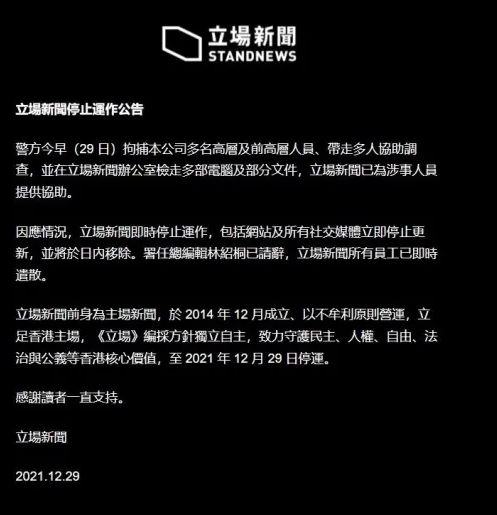

Stand News was a free non-profit online news website based in Hong Kong from 2014 to 2021. Founded in December 2014, it was the successor of House News. It primarily focused on social and political issues in Hong Kong, and generally took a pro-democracy editorial position.

_(Screenshot of The Standnews Front Page before final closure)_

## URLs
- https://www.thestandnews.com (offline)
- Web page collection from Internet Archive:
https://web.archive.org/web/*/https://www.thestandnews.com
- http://standnews.co.uk/ (British edition)

## Archives

- [Internet Archive on The StandNews](https://web.archive.org/web/*/http://www.thestandnews.com/)
- [By Collection.News Project](https://collection.news/thestandnews)

