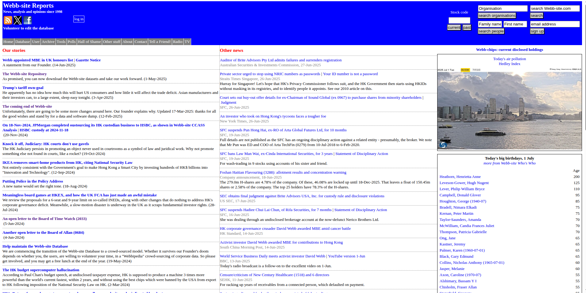

David Webb 所創立的財經網站 Webb-site，自 1998 年起成為香港企業治理和股市透明度的重要監察平台。他多年來追蹤並揭露香港上市公司董事、高管及顧問的資料，致力於促進資訊公開與小股東權益。他以其精密的數據庫與嚴謹的調查報導，揭示如「謎網」等企業之間的資本運作關係，並長期關注關聯交易、隱藏貸款及股權稀釋等問題。他拒絕盲目相信市場或監管機構，強調投資人應自己做功課、獨立思考。

在罹患癌症、生命進入倒數階段後，Webb 宣布將有序關閉 Webb-site.com，但作為留給公眾的最後禮物，他承諾會把網站的完整資料庫和自研數據收集工具，開放至 GitHub 公共儲存庫，供後人自由使用。他同時強調，不會授權他人延續網站的營運，避免其精神被濫用為推廣詐騙、假資訊或他所不認同的立場。這一決定展現他始終如一的原則與對香港市場秩序的承諾，也讓 Webb-site 的精神得以延續而非被異化。

Webb-site.com is a Hong Kong-based financial news and information website, founded by David Webb in 1998. It provides independent analysis of Hong Kong's financial markets, companies, and government policies. The site is known for its critical stance on corporate governance issues and its advocacy for shareholder rights.
 

## Archives
- [Owner's Archive](https://drive.google.com/drive/folders/13mzAvvufXC3QmH8OvMVx2juUi7qdnVLL)
- [Wayback Machine](https://web.archive.org/web/*/https://webb-site.com/)

